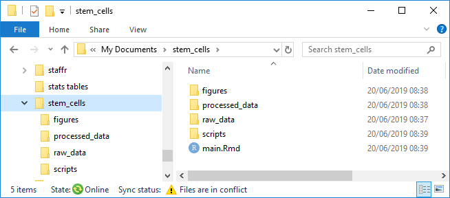

background-image: url(pics/Royal_Society_of_Biology.png)
background-position: 50% 5%
background-size: 400px

```{r setup, include=FALSE}
knitr::opts_chunk$set(echo = TRUE, 
                      message = FALSE,	
                      warning = FALSE, 
                      cache = TRUE)
options(htmltools.dir.version = FALSE)
```

```{r packages, include=FALSE}
library(kableExtra)
library(tidyverse)
```

class: inverse, center, middle

# An Introduction to Reproducible<br>Analyses in R
## Emma Rand<br>emma.rand@york.ac.uk
University of York, 2019-06-24

---

# Goal!

By the end of today you'll be able to do something like this:
<!-- standard markdown report in pdf, word or html -->
<!-- include a table, inline code, a figure,  -->

## demo.....

### install `tidyverse`

---
# What this workshop is and is not

.pull-left[

Is an introduction to
* R  
* some universal and highly transferable concepts 
* the skills for organising reproducible analyses  
 


]

.pull-right[

It is not
* An introduction to statistics<sup>1</sup>  
* Magic  

&nbsp;  
&nbsp;  
&nbsp;  
&nbsp;  
[1] but ...
]


---
# Workshop overview


```{r echo = FALSE}
timetable <- read.table("slide_data/timetable.txt", 
                        header = T, 
                        colClasses = c("character", 
                                       "character", 
                                       "character"))
DT::datatable(
  timetable,
  fillContainer = FALSE, 
  options = list(pageLength = 4),
  rownames = FALSE)
```

---

# Before Lunch

## Introduction 1000 - 1115

* Rationale for scripting  
* Why use R to script  
* Finding your way round RStudio  
* Typing in data, doing some calculations on it, plotting it
* Understanding the manual  

---

# Before Lunch

## Introduction 1000 - 1115
* Rationale for scripting  
* Why use R to script  
* Finding your way round RStudio  
* <mark style="background-color: #e6f0ff">Typing in data, doing some calculations on it, plotting it</mark>
* Understanding the manual  

---
background-image: url(pics/tidyverse_logo.png)
background-position: 95% 5%
background-size: 200px

# Before Lunch

**Introduction 1000 - 1115** 
* Rationale for scripting  
* Why use R to script  
* Finding your way round RStudio  
* Typing in data, doing some calculations on it, plotting it
* Understanding the manual  

**Working with Data 1115 - 1230**  

* Importing data  
  * working directories and paths  
* Summarising and visualising with the [`tidyverse`](https://www.tidyverse.org/)  
* Installing and loading packages
* The concept of 'tidy'<sup>1</sup> data

<small>[1] Wickham, H. (2014), "Tidy Data," Journal of Statistical Software, 59, available at [http://www.jstatsoft.org/article/view/v059i10](http://www.jstatsoft.org/article/view/v059i10)</small>

---
class: inverse, center, middle
# Introduction 
## 1000 - 1115

---
background-image: url(pics/rationale1.png)
background-position: 50% 35%
background-size: 600px

# Rationale for scripting analysis
<br>
<br>
<br>
<br>
<br>
<br>
<br>
<br>
<br>
<br>
.pull-left[
## Generating the results
]

.pull-right[
## Analysing and reporting them
]
---
background-image: url(pics/rationale2.png)
background-position: 50% 35%
background-size: 600px

# Rationale for scripting analysis

---
background-image: url(pics/rationale3.png)
background-position: 50% 35%
background-size: 600px

# Rationale for scripting analysis

---

background-image: url(pics/rationale5.png)
background-position: 50% 35%
background-size: 800px

# Rationale for scripting analysis

---

## Why R? 

* Open source and free
--
.......But so is Python
  
--

* R caters to users who do not see themselves as programmers, but then allows them to slide gradually into programming  


--

* Language for data analysis and graphics  

--

* Community - welcoming, inclusive.  
  [RForwards](https://forwards.github.io/)  
  [RLadies](https://rladies.org/)
  
--

* R Markdown  
  R's "killer feature"  .......Super-charged reproducibility!

---

# Finding your way round RStudio

**Live demonstration**

Overview [Larger](http://www-users.york.ac.uk/~er13/RStudio%20Anatomy.svg)

```{r, echo=FALSE, out.width = "600px"}
knitr::include_graphics("http://www-users.york.ac.uk/~er13/RStudio%20Anatomy.svg")
```


There is an [RStudio cheatsheet](rstudio-ide.pdf) which covers more advanced RStudio features.

---

# Finding your way round RStudio

**Live demonstration**

* the panels
* making yourself comforatable
* typing in the console sending commands
* using R as a calculator
* assigning values
* where to see objects
* using a script - typing doesn't make it happen you need to execute
* comments \#
* data types and structures
* functions `c()`, `class()` and `str()`
* types of of R files: .R, .RData . RHistory


---
# Finding your way round RStudio

**Summary of Live demonstration: <mark style="background-color: #e6f0ff">The panels</mark>**

.pull-left[
Top left
* Script - where you write, edit and save code and comments you want to keep  
  
---
Bottom left  
* console - commands get executed here and can be typed here  
]

.pull-right[
Top right
* Environment - where to see your ojects  
* History - a list of every command you sent  
--- 
Bottom right  
* Files - a file explorer  
* Packages - the packages you have installed and a method of installing packages  
* Help - the manual  
* Plots - where your plots go  
]

---
# Finding your way round RStudio

**Summary of Live demonstration: <mark style="background-color: #e6f0ff">Types of R files</mark>**

* .R 
  a script file:  code (to save) and comments
* .RData  
  a environment file also know as a workspace: objects but no code
* .RHistory  (everything you typed, mostly wrong!)
 
**Using a script**  
* any R code can be executed from a script
* code can be (should be!) commented  
* comments start with a `#`

---
# Finding your way round RStudio

**Summary of Live demonstration: <mark style="background-color: #e6f0ff">Data types and structures</mark>**

These are the most commonly needed but there are others
.pull-left[
Types
* numeric
* integer
* logical
* character
]
.pull-right[
Structures
* vectors
* factors
* dataframes
]

---

# We are here

## Introduction 1000 - 1115
* Rationale for scripting  
* Why use R to script  
* Finding your way round RStudio  
* <mark style="background-color: #e6f0ff">Typing in data, doing some calculations on it, plotting it</mark>
* Understanding the manual  

--

For slides purposes called...
### <mark style="background-color: #e6f0ff">Typing in data, calcs, plots</mark>

---
# Typing in data, calcs, plots
## The goal
We will work some data on the number of males in 64 bird nests with a clutch size of 5.
--
.pull-left[
You are going to make this data, find the mean number of males per nest...
```{r , echo=FALSE}
n <- c(0, 1, 2, 3, 4, 5)
freq <- c(4, 13, 14, 15, 13, 5)
df <- data.frame(n, freq)
knitr::kable(df, 
             format = "html",
             col.names = c("No. males", "No. nests"),
             row.names = FALSE)
```
]
--
.pull-right[
... and plot it


```{r , echo=FALSE,fig.width=5,fig.height=5}
barplot(freq, 
        names.arg = n,
        xlab = "Number of males",
        ylab = "Number of nests")
```
]


---
# Typing in data, calcs, plots

## Getting set up

In Windows explorer, make yourself a folder for this work.  

--

<mark style="background-color: #e6f0ff">Make a note of it!</mark>

--

In RStudio, [set your working directory](pics/menusetwd.png) to the folder you created above.  

--

Make a [new script](pics/newscript.png) file called RBS_am.R to carry out the rest of the work.  

---
# Typing in data, calcs, plots

## Putting the data into R data structures

Make a vector `n` that holds the numbers 0 to 5. 
```{r}
# the number of males in a clutch of five
n <- c(0, 1, 2, 3, 4, 5)
```

* Write your command in the script file  
* Notice I have used a comment  
--

* Make sure you have your cursor on the line you want to execute  
* Run it using the  button or doing Ctrl+Enter<sup>1</sup>. 

&nbsp;  
&nbsp;  
&nbsp;  
&nbsp;  

<small>[1] Ctrl+Enter is the default shortcut to run the current line or selection. I prefer to set to Ctrl+R</small>
---
# Typing in data, calcs, plots

## Putting the data into R data structures

Let's take a look at it using `str()` (structure) and `class()`<sup>1</sup>:

```{r}
class(n)
str(n)
```
It's a numeric vector []

&nbsp;  

<small>[1] These commands are useful to check what data type you're working with</small>

---
# Typing in data, calcs, plots

## Putting the data into R data structures

Now create a vector called `freq` containing the numbers of nests with 0 to 5 males. 

```{r}
# the number of nests with 0 to 5 males
freq <- c(4, 13, 14, 15, 13, 5)
```
--
We can use `sum(freq)` to check we get the total number of nests expected, 64

```{r}
# the total number of nests
sum(freq)
```

---
# Typing in data, calcs, plots

## Finding the mean
Our data is in the form of a frequency table so to find the mean number of males per nest we need find the total number of males like this:
.pull-left[
```{r , echo=FALSE}
df$product <- df$n * df$freq
totalm <- sum(df$product)
totaln <- sum(df$freq)
dfchar <- df %>%
  mutate_all(as.character)
dfchar <- rbind(dfchar, c("Total", totaln, totalm))
dfchar %>% kable(format = "html",
                 col.names = c("No. males", "No. nests", "No. males *No. nests"),
                 row.names = FALSE) %>% 
  kable_styling() %>%
  row_spec(6, hline_after = TRUE) %>%
  row_spec(7, bold = TRUE, background = "#C0C2C9")
```
]

.pull-right[

$$\frac{163}{64} = 2.55$$
]

---
# Typing in data, calcs, plots

## Finding the mean

.pull-left[
Find the total number of nests
```{r}
# total number of nests
total_nests <- sum(freq)
```
 

Find the total number of males
```{r}
# total number of males
total_males <- sum(n * freq)
```
 

Find the mean number of males per nest
```{r}
# mean number males/nest
total_males/total_nests
```
]

--

.pull-right[

R works 'elementwise' unlike most programming lanaguges.  
` n * freq`
gives

$$\begin{bmatrix}0\\1\\2\\3\\4\\5\end{bmatrix}\times\begin{bmatrix}4\\13\\14\\15\\13\\5\end{bmatrix}=\begin{bmatrix}0\\13\\28\\45\\52\\25\end{bmatrix}$$

It was designed to make it easy to work with data.
]


---
# Typing in data, calcs, plots

## Plotting
.pull-left[
Now for our first figure using the base<sup>1</sup> plotting function `barplot()`.  

Making default figures is often easy - useful if you just want to quickly explore your data.
&nbsp;  
&nbsp;  
&nbsp;  
&nbsp;  
&nbsp;  
<small>[1] the 'base' plotting system is part of the base distribution, _i.e.,_ all the packages that come with the basic installation of R.</small>
]

--

.pull-right[
Create simple barplot like this:

```{r fig.width=5,fig.height=5}
barplot(freq)
```

]
---
# Using the help manual

The default barplot doesn't have:
* labels to say what each bar represents  
* axis labels

'Arguments' can be added to the `barplot()` command.  

Commands do something with/to an object and their arguments specify:
* what object to do it to  
* how exactly to do it  

Many commands have defaults so you need only supply an object.

--

Open the manual page using:
```{r eval=FALSE}
?barplot
```

---
# Using the help manual

## Key points

* **Description** an overview of what the command does  

* **Usage** lists argument    
  * format: argument name = default value  
  * some arguments MUST be supplied, they have no defaults
  * ... essentially, etc

* **Arguments** gives the detail on how the arguments work

* **Details** decribes how the command works in more detial  

* **Value** gives the output of the command 

* Don't be too perturbed by not fully understanding the information

---
# Typing in data, calcs, plots

## Plotting
.pull-left[

```{r fig.width=5,fig.height=5}
barplot(freq, names.arg = n)
```
]


--
.pull-right[
We can add names using the `names.arg` argument.

The names of the bars are the numbers of males in a nest. These are in our variable `n`

Arguments are separted by commas 

`command(argument1, argument2, argument3, ...)`

]

---

# Typing in data, calcs, plots

## Plotting

.pull-left[
Can you use the manual to add labels for both axes?

Skip to the next slide if you want more challenge.

]
--

.pull-right[
```{r ,fig.width=4,fig.height=4}
barplot(freq, 
        names.arg = n,
        xlab = "Number of males",
        ylab = "Number of nests")
```
]
---

# Typing in data, calcs, plots

## Plotting

.pull-left[
Can you use the manual to add labels for both axes?

Skip to the next slide if you want more challenge.

<style>
div.blue { background-color:#e6f0ff; border-radius: 5px; padding: 20px;}
div.grey { background-color:#d3d3d3; border-radius: 0px; padding: 0px;}
</style>

<div class = "blue">
**Top Tip** 

Make your code easier to read by using white space and new lines
* put spaces around `=` , `->` and after `,`
* use a newline after every comma in a command with lots of arguments
]
</div>

.pull-right[
```{r ,fig.width=4,fig.height=4}
barplot(freq, 
        names.arg = n,
        xlab = "Number of males",
        ylab = "Number of nests")
```
]

---

# Plotting - extra challenges

.pull-left[
Make all the bars red.

Colours can be given by their name: "red" 

Or by their hexadecimal code: "#FF3030".  

You can look these up as follows:  

[By colour name](pics/colournames.pdf)

[By hexadecimal code](pics/colourhex.pdf)

Skip to the next slide if you want more challenge.
]

--

.pull-right[
```{r ,fig.width=5,fig.height=5}
barplot(freq, 
        names.arg = n,
        xlab = "Number of males",
        ylab = "Number of nests",
        col = "#FF3030")
```
]
---
# Plotting - extra challenges

.pull-left[
Make the bars alternating red, blue, and yellow. 

To solve this you will need to put together the concept of setting an argument with the concept of collecting several things together to make one thing.

]

--

.pull-right[
```{r ,fig.width=5,fig.height=5}
barplot(freq, 
        names.arg = n,
        xlab = "Number of males",
        ylab = "Number of nests",
        col = c("red", "blue", "yellow"))
```
]
---

background-image: url(pics/ggplot.jpg)
background-position: 95% 5%
background-size: 100px

# Typing in data, calcs, plots

## Plotting using `ggplot2`

The `barplot()` command is part the 'base' plotting system. Base packages (collections of commands) always come with R. 

--

Other packages, such as [ggplot2](https://ggplot2.tidyverse.org/)<sup>1</sup> need to be added ('installed').

&nbsp;  
&nbsp;  
&nbsp;  
&nbsp;  
&nbsp;  
&nbsp;  

<small>[1] A fantastic plotting system which has a common conceptual framework for visualisation based on [The Grammar of Graphics](https://www.amazon.com/Grammar-Graphics-Statistics-Computing/dp/0387245448/ref=as_li_ss_tl?ie=UTF8&qid=1477928463&sr=8-1&keywords=the+grammar+of+graphics&linkCode=sl1&tag=ggplot2-20&linkId=f0130e557161b83fbe97ba0e9175c431)</small>
---
# Packages

## Installing - you only do once

I recommend installing all of the `tidyverse` packages

```{r eval=FALSE}
install.packages("tidyverse")
```
--

## Loading - you do once each R session

To use a package which has already been installed you need to 'add it to your library' with the `library()` command.


```{r eval=FALSE}
library(tidyverse)
```
`tidyverse` includes `ggplot2` as well as `dplyr` and `tidyr` functions from which we will also use.

---

background-image: url(pics/ggplot.jpg)
background-position: 95% 5%
background-size: 100px

# Plotting using `ggplot2`

`ggplot2` is the name of the package

`ggplot()` is its most important command

Using `ggplot2` might seem more complex than the base plotting system at first. 

However, graphs only need to get very slightly more involved for it to become much easier to use.

--

`barplot()` needs a vector of bar heights

`ggplot()` needs a dataframe
---

background-image: url(pics/ggplot.jpg)
background-position: 95% 5%
background-size: 100px

# Plotting using `ggplot2`

First, make sure you have a dataframe.

We need to make one from `n` and `freq`

```{r}
nest_data <- data.frame(n, freq)
```

--
And check
```{r}
str(nest_data)
```

--

`nest_data` is just a name we have given the dataframe

Click on `nest_data` in the Environment pane to see a spreadsheet-like view of it.

---
background-image: url(pics/ggplot.jpg)
background-position: 95% 5%
background-size: 100px

# Plotting using `ggplot2`

Create a simple barplot using `ggplot` like this:

```{r fig.width=4,fig.height=4,eval=FALSE}
ggplot(data = nest_data, aes(x = n, y = freq)) +
  geom_bar(stat = "identity")
```

.pull-left[
```{r fig.width=4,fig.height=4,echo=FALSE}
ggplot(data = nest_data, aes(x = n, y = freq)) +
  geom_bar(stat = "identity")

```
]

--

.pull-right[
`ggplot()` alone creates a blank plot. 

`ggplot(data = nest_data)` looks the same. 

`aes()` gives the 'Aesthetic mappings'. How variables (columns) are mapped to visual properties (aesthetics) e.g., axes, colour, shapes.

`ggplot(data = nest_data, aes(x = n, y = freq))` produces a plot with axes 

`geom_bar` A 'Geom' (Geometric object) gives the visual representations of the data: points, lines, bars, boxplots etc.

]

---
background-image: url(pics/ggplot.jpg)
background-position: 95% 5%
background-size: 100px

# Plotting using `ggplot2`

You can add an axis label like this:

```{r eval=FALSE}
ggplot(data = nest_data, aes(x = n, y = freq)) +
  geom_bar(stat = "identity") +
  xlab("Number of males")

```
.pull-left[
```{r fig.width=4,fig.height=4,echo=FALSE}
ggplot(data = nest_data, aes(x = n, y = freq)) +
  geom_bar(stat = "identity") +
  xlab("Number of males")

```
]
.pull-right[
Each 'layer' is added to the `ggplot()` command with a '+'

--

<div class = "blue">
**We can customise much more and will return to this later.....**

<small>[ggplot cheatsheet](https://www.rstudio.com/wp-content/uploads/2015/03/ggplot2-cheatsheet.pdf) if you can't wait</small>
]
</div>


---

class: inverse, center, middle

# Working with Data
## 1115 - 1230


---
# Working with Data
## The goal

```{r echo=FALSE}
pigeon2 <- read.table("data/pigeon2.txt", header = T)
pigeon3 <- gather(data = pigeon2, key = population, value = distance)
library(Rmisc)
sumpig <- summarySE(pigeon3, measurevar = "distance", groupvars = "population")
sumpig %>% 
  select(-ci, -sd) %>% 
  kable(format = "html",
                 col.names = c("Population", "N", "Mean", "SE"),
                 row.names = FALSE) %>%
  add_header_above(c(" " = 2, " Interorbital distance" = 2))

```
.pull-left[
```{r fig.width=5, fig.height=4,echo=FALSE}
ggplot(data = pigeon3, aes(x = distance, fill = population))  +
  geom_density(col = "black", alpha = 0.3) +
  xlab("Interorbital distance (mm)") +
  theme_classic()
```
]
.pull-right[
```{r fig.height=4, fig.width=5,echo=FALSE}
ggplot(data = pigeon3, aes(x = population, y = distance)) +
  geom_violin() +
  xlab("Population") +
  ylab("Interorbital distance (mm)") + 
  theme_classic()
  
```
]

---
background-image: url(pics/interorbital.png)
background-position: 95% 5%
background-size: 200px

# Working with Data: single variable 
## Importing

**The Data**

Measurements of interorbital width (in mm) in 40 domestic pigeons measured to the nearest 0.1 mm

Save a copy [pigeon.txt](data/pigeon.txt)

--

Import the data in to R with `read.table()`:

```{r eval=FALSE}
pigeon <- read.table("pigeon.txt", header = TRUE)
```

```{r echo=FALSE}
pigeon <- read.table("data/pigeon.txt", header = TRUE)
```
--
`header = TRUE` is an argument in the `read.table()` command which indicates that the datafile has a header, _i.e._, the first value in the file is the variable name

--

You should see an object `pigeon` in the Environment window. 

---
background-image: url(pics/interorbital.png)
background-position: 95% 5%
background-size: 200px

# Working with Data: single variable
## Importing

Examine the structure

```{r}
str(pigeon)
```

The object created by `read.table()` is a dataframe. 

That's handy! 

---
background-image: url(pics/interorbital.png)
background-position: 95% 5%
background-size: 200px

# Working with Data: single variable 
## Understanding a dataframe 

A dataframe is made of columns and rows

The columns are the variables; the rows are the observations

--

To refer a column inside a dataframe (a single column data) we need to use the dollar notation: `dataframe$columnname`

--

So to output all of the one column we can use:
```{r}
pigeon$interorbital
```
---
background-image: url(pics/interorbital.png)
background-position: 95% 5%
background-size: 200px

# Working with Data: single variable 
## Summarising single group data  

R provides many functions to allow you to make calculations on your data.

For example, the mean
```{r}
mean(pigeon$interorbital)
```

--

Which functions will calculate the standard deviation and the number of cases, _i.e._, the length of the column
---
background-image: url(pics/interorbital.png)
background-position: 95% 5%
background-size: 200px

# Working with Data: single variable 
## Summarising single group data 

Standard deviation
```{r }
sd(pigeon$interorbital)
```

--

Number of cases
```{r }
length(pigeon$interorbital)
```
---
background-image: url(pics/interorbital.png)
background-position: 95% 5%
background-size: 200px

# Working with Data: single variable 
## Plotting single group data 

```{r fig.height=4, fig.width=4}
ggplot(data = pigeon, aes(x = interorbital)) +
  geom_histogram() +
  xlab("Interorbital distance (mm)")
  
```
---
background-image: url(pics/interorbital.png)
background-position: 95% 5%
background-size: 200px

# Working with Data: single variable 
## Plotting single group data 

```{r fig.height=4, fig.width=4,eval=FALSE}
ggplot(data = pigeon, aes(x = interorbital)) +
  {{geom_histogram(bins = 10, col = "black")}} +
  xlab("Interorbital distance (mm)")
  
```
.pull-left[
```{r fig.height=4, fig.width=4,echo=FALSE}
ggplot(data = pigeon, aes(x = interorbital)) +
  {{geom_histogram(bins = 10, col = "black")}} +
  xlab("Interorbital distance (mm)")
  
```
]
--

.pull-right[

We will cover more figure options as we go through the afternoon
]

---
background-image: url(pics/interorbital.png)
background-position: 95% 5%
background-size: 200px

# Working with Data: two variables 
## Importing 2

This section will teach you about three concepts:

--

1. 'working directories', 'paths' and  'relative paths' 

--

2. dealing with data in more than group  

--

3. the concept of 'tidy' data

--

We will work with the interorbital distances of domestion pigeons in two different populations: A and B

---
background-image: url(pics/interorbital.png)
background-position: 95% 5%
background-size: 200px

# Working with Data: two variables 
## Importing 2

It is good practice to organise your files into a folder structure. 

For example, I often use:



---
background-image: url(pics/interorbital.png)
background-position: 95% 5%
background-size: 200px

# Working with Data: two variables 
## Importing 2

Make a folder in your working directory called 'data'

You can do this either RStudio  - see the bottom right Files panel

or

in Windows explorer

--

Forgotten where you are? Use
```{r eval=FALSE}
getwd()
```

--

Save a copy of [pigeon2.txt](../data/pigeon2.txt) to the 'data' folder


---
background-image: url(pics/interorbital.png)
background-position: 95% 5%
background-size: 200px

# Working with Data: two variables 
## Importing

To read the data in to R you need to use the 'relative path' to the file in the `read.table()` command:

```{r}
pigeon2 <- read.table("data/pigeon2.txt", header = TRUE)
```

--

The `data/` part is the 'relative path' to the file. 

--

It says where the file is **relative to your working directory**

pigeon2.txt is inside a folder (directory) called 'data' which is in your working directory.

---
background-image: url(pics/interorbital.png)
background-position: 95% 5%
background-size: 200px

# Working with Data: two variables 
## Importing

Look at the structure of the dataframe pigeon2 using `str()`

```{r }
str(pigeon2)
```
--

It's a dataframe with two variables (columns) called A and B

The datatype of both variables is numeric.

---
background-image: url(pics/interorbital.png)
background-position: 95% 5%
background-size: 200px


# Working with Data: two variables 
## Summarising multi-group data

Find the mean for each population. 

Remember, to refer a column inside a dataframe (a single column data) we need to use the dollar notation: `dataframe$columnname`

--

The mean of column $A

```{r }
mean(pigeon2$A)
```

The mean of column $B

```{r }
mean(pigeon2$B)
```

---
background-image: url(pics/interorbital.png)
background-position: 95% 5%
background-size: 200px

# Working with Data 
## Tidy format

Instead of having a population in each column, we very often have, **and want**, data organised so the measurements are all in one column and a second column gives the group. This format is described as 'tidy'<sup>1</sup>

Tidy data has a variable in each column and only one observation (case) per row.

&nbsp;
&nbsp;
&nbsp;
&nbsp;
&nbsp;
&nbsp;

<small>[1] Wickham, H. (2014), "Tidy Data," Journal of Statistical Software, 59, available at [http://www.jstatsoft.org/article/view/v059i10](http://www.jstatsoft.org/article/view/v059i10)</small>
---
background-image: url(pics/interorbital.png)
background-position: 95% 5%
background-size: 200px

# Working with Data 
## Tidy format

Tidy data has a variable in each column and only one observation (case) per row.

Suppose we had just 3 individuals in each population:

.pull-left[
**NOT TIDY!**
```{r echo=FALSE}
knitr::kable(pigeon2[1:3,], 
             format = "html")
```
]
```{r echo=FALSE}
pigeon3 <- gather(data = pigeon2, 
                  key = population, 
                  value = distance)
```

.pull-right[
**TIDY!**
```{r echo=FALSE}
knitr::kable(head(pigeon3[c(1:3,41:43),]), 
             format = "html",
             row.names = FALSE)
```
]


---
background-image: url(pics/interorbital.png)
background-position: 95% 5%
background-size: 200px

# Working with Data 
## Tidy format

We can make the data tidy with `gather()`<sup>1</sup>.

`gather()` needs 3 arguments:
--

* the dataframe 
--

* a `key` the grouping variable 
--

* a `value` the measurement variable.
--

```{r}

pigeon3 <- gather(data = pigeon2, key = population, value = distance)
str(pigeon3)
```

&nbsp;
&nbsp;

<small>[1] `gather()` is a function from a package called `tidyr` which is one of the `tidyverse` packages</small>

---
background-image: url(pics/interorbital.png)
background-position: 95% 5%
background-size: 200px

# Working with Data 
## Summarising multi-group data

Now we have a dataframe in tidy format which will make it easier to summarise, analyse and visualise.

How can we summarise now?

--

If we use 
```{r}
mean(pigeon3$distance)
```

We will get the mean of the two populations combined.

--

To get the mean of each population we use `tapply()`. 

---
background-image: url(pics/interorbital.png)
background-position: 95% 5%
background-size: 200px

# Working with Data 
## Summarising multi-group data

`tapply()` takes three arguments: 
--

* the measurement variable 
--

* the grouping variable   
--

* function to be applied:  

`tapply(measurement, grouping, function)`
---
background-image: url(pics/interorbital.png)
background-position: 95% 5%
background-size: 200px

# Working with Data 
## Summarising multi-group data

```{r}
tapply(pigeon3$distance, pigeon3$population, mean)
```

--

Find the number of cases in each group

Finshed and need more challenge? Go to the next slide

--

The number of cases
```{r}
tapply(pigeon3$distance, pigeon3$population, length)
```

---
background-image: url(pics/interorbital.png)
background-position: 95% 5%
background-size: 200px

# Summarising - extra challenges

Find the variance in each population

Finshed and need more challenge? Go to the next slide

--

```{r}
tapply(pigeon3$distance, pigeon3$population, var)
```

---
background-image: url(pics/interorbital.png)
background-position: 95% 5%
background-size: 200px

# Summarising - extra challenges

Calculate the standard errors for each group.

Standard errors are given by 

$$s.e. = \frac{s.d.}{\sqrt{n}} $$
where $s.d.$ is the standard deviation of a sample and $n$ is the size of the sample.
--

You will need to
* calculate and assign the standard deviations to variable
* calculate and assign the number of cases to variable
* find out what function finds the squareroot of its argument
* apply what you know about the elementwise way R works

---
background-image: url(pics/interorbital.png)
background-position: 95% 5%
background-size: 200px

# Summarising - extra challenges

Calculate the standard errors for each group.

```{r}
sds <- tapply(pigeon3$distance, pigeon3$population, sd)
ns <- tapply(pigeon3$distance, pigeon3$population, length)
ses <- sds / sqrt(ns)
ses
```
--

To round
```{r}
round(ses, 3)
```

---
background-image: url(pics/interorbital.png)
background-position: 95% 5%
background-size: 200px

# Working with Data 
## Plotting multi-group data

```{r eval=FALSE}
ggplot(data = pigeon3, aes(x = distance)) +
  geom_histogram(bins = 10, col = "black") +
  xlab("Interorbital distance (mm)")
  
```


.pull-left[
```{r fig.height=4, fig.width=4, echo=FALSE}
ggplot(data = pigeon3, aes(x = distance)) +
  geom_histogram(bins = 10, col = "black") +
  xlab("Interorbital distance (mm)")
  
```
]

.pull-right[

Plots the whole data set without separating the populations

]

---
background-image: url(pics/interorbital.png)
background-position: 95% 5%
background-size: 200px

# Working with Data 
## Plotting multi-group data


```{r fig.height=4, fig.width=5,eval=FALSE}
{{ggplot(data = pigeon3, aes(x = distance, fill = population))}} +
  geom_histogram(bins = 10, col = "black") +
  xlab("Interorbital distance (mm)")
  
```


.pull-left[

```{r fig.height=4, fig.width=5,echo=FALSE}
ggplot(data = pigeon3, aes(x = distance, fill = population)) +
  geom_histogram(bins = 10, col = "black") +
  xlab("Interorbital distance (mm)")
  
```
]

--

.pull-right[

We need only 'map' the population variable to the 'use the `fill` aesthetic 

Aesthetics include:
* x
* y
* color
* fill
* shape
* size
* alpha

]
---
background-image: url(pics/interorbital.png)
background-position: 95% 5%
background-size: 200px

# Working with Data 
## Plotting multi-group data

```{r fig.height=4, fig.width=5,eval=FALSE}
ggplot(data = pigeon3, aes(x = distance, fill = population)) +
  {{geom_density(col = "black")}} +
  xlab("Interorbital distance (mm)")
  
```

.pull-left[
```{r fig.height=4, fig.width=5,echo=FALSE}
ggplot(data = pigeon3, aes(x = distance, fill = population)) +
  geom_density(col = "black") +
  xlab("Interorbital distance (mm)")
  
```
]

--

.pull-right[

Changing the `geom` from `geom_histogram()` to `geom_density()`

]
---
background-image: url(pics/interorbital.png)
background-position: 95% 5%
background-size: 200px

# Working with Data 
## Plotting multi-group data

```{r fig.height=4, fig.width=5,eval=FALSE}
ggplot(data = pigeon3, aes(x = distance, fill = population))  +
  {{geom_density(col = "black", alpha = 0.3)}} +
  xlab("Interorbital distance (mm)")
  
```

.pull-left[
```{r fig.height=4, fig.width=5,echo=FALSE}
ggplot(data = pigeon3, aes(x = distance, fill = population)) +
  geom_density(col = "black", alpha = 0.3) +
  xlab("Interorbital distance (mm)")
  
```
]


.pull-right[

And altering the transparancy using `alpha`

]
---
background-image: url(pics/interorbital.png)
background-position: 95% 5%
background-size: 200px

# Working with Data 
## Plotting multi-group data

```{r fig.height=4, fig.width=5,eval=FALSE}
ggplot(data = pigeon3, aes(x = distance, fill = population))  +
  geom_density(col = "black", alpha = 0.3) +
  xlab("Interorbital distance (mm)") +
  {{theme_classic()}}
  
```

.pull-left[
```{r fig.height=4, fig.width=5,echo=FALSE}
ggplot(data = pigeon3, aes(x = distance, fill = population)) +
  geom_density(col = "black", alpha = 0.3) +
  xlab("Interorbital distance (mm)") +
  theme_classic()
  
```
]


.pull-right[

And using a built in `theme()` to make it more publication friendly.

]
---
background-image: url(pics/interorbital.png)
background-position: 95% 5%
background-size: 200px

# Working with Data 
## Plotting multi-group data

```{r fig.height=4, fig.width=4,eval=FALSE}
{{ggplot(data = pigeon3, aes(x = population, y = distance)) }} +
  {{geom_point()}} +
  xlab("Population") +
  ylab("Interorbital distance (mm)")
  
```

.pull-left[
```{r fig.height=4, fig.width=4,echo=FALSE}
ggplot(data = pigeon3, aes(x = population, y = distance)) +
  geom_point() +
  xlab("Population") +
  ylab("Interorbital distance (mm)")
  
```
]


.pull-right[

Instead of plotting the distribution, we can plot the which population it is on the _x_-axis and the distances on the _y_-axis **as points**

]

---

background-image: url(pics/interorbital.png)
background-position: 95% 5%
background-size: 200px

# Working with Data 
## Plotting multi-group data

```{r fig.height=4, fig.width=4,eval=FALSE}
ggplot(data = pigeon3, aes(x = population, y = distance))  +
{{geom_violin()}} +
  xlab("Population") +
  ylab("Interorbital distance (mm)") + 
  theme_classic()
  
```

.pull-left[
```{r fig.height=4, fig.width=4,echo=FALSE}
ggplot(data = pigeon3, aes(x = population, y = distance)) +
  geom_violin() +
  xlab("Population") +
  ylab("Interorbital distance (mm)") + 
  theme_classic()
  
```
]


.pull-right[

Instead of plotting the distribution, we can plot the which population it is on the _x_-axis and the distances on the _y_-axis...**as a volin plot**

]

---
class: inverse, center, middle

# Lunch!

---
# Workshop overview


```{r echo = FALSE}
timetable <- read.table("slide_data/timetable.txt", 
                        header = T, 
                        colClasses = c("character", 
                                       "character", 
                                       "character"))
DT::datatable(
  timetable,
  fillContainer = FALSE, 
  options = list(pageLength = 4),
  rownames = FALSE)
```

---
class: inverse, center, middle

# Reproducible Reports using R Markdown
## 1315 - 1430

---


<iframe src="https://docs.google.com/forms/d/e/1FAIpQLSfaHl92gPSWI4jRG79Un6d4OhXWsPGhN0YwVV4kgfAQgCKgBg/viewform?embedded=true" width="500" height="700" frameborder="0" marginheight="0" marginwidth="0">Loading...</iframe>

---
# How do you work?

* What program do you analyse your data in?  


* What program do you plot your data in?  


* What program do you use to write up the results to submit to a journal (or similar)?  


* What is your process for getting your summary data, statistical results, tables and figures in to your report?  


--

* What do you do when you get additional data that increases your sample sizes?  

--

* What do you do if you wrote in Word formated for one journal and now have to submit in PDF formated for another?

--

Typically people analyse, plot and write up in different programs. Graphs are saved to files and copied and pasted into the final report. 

This process relies on manual labour. If the data changes, the author must repeat the entire process to update the report.

---
background-image: url(pics/rmarkdown.png)
background-position: 95% 5%
background-size: 100px

# R Markdown

The brilliance of R Markdown is that you can use a **single R Markdown file** to:

* save and execute code  

* do all your data processing, analysis and plotting

* generate high quality reports that can be shared with an audience


This is a time-efficient and reproducible way to write!


---
background-image: url(pics/rmarkdown.png)
background-position: 95% 5%
background-size: 100px

# R Markdown

## Many output formats are supported!

.pull-left[

]
.pull-right[
* Word
* Webpages - many styles and themes
* PDF
* journal article formats for many journals
* webslides
* powerpoint
* books
* blogs
* posters
* web applications including interactive

]

---
background-image: url(pics/rmarkdown.png)
background-position: 95% 5%
background-size: 100px

# R Markdown

## Let's get started...organising

You are going to work with some made-up data on the myoglobin content in the skeletal muscle of three species of seal

--

Make a folder called 'seals'

--

Inside 'seals', make folders called 'raw_data' and 'processed_data'

--

.pull-right[
** I strongly recommend avoiding spaces in names of files, folders and variable names** 

R can cope with them....  but they can often confuse humans!
]
--

Save a copy of [seal.txt](seals/raw_data/seal.txt) to the 'raw_data' folder

--

Set your working directory to 'seals'

---

background-image: url(pics/rmarkdown.png)
background-position: 95% 5%
background-size: 100px

# R Markdown

## Live demo

Just watch for a while....

---

background-image: url(pics/rmarkdown.png)
background-position: 95% 5%
background-size: 100px

# R Markdown

## Key points from the demo


* mixes text and code  
* human readable  
* YAML header between the  \-\-\-
* code chunk options control whether the code and its output end up in your 'knitted' document  
* comments   
  * in a code chunk the \# is still used for comments  
  * in the text a comment is written like this  <!\-\- a comment \-\->
  * but use Ctrl+Shift+C  
* \# in the text indicate headings  


---
background-image: url(pics/rmarkdown.png)
background-position: 95% 5%
background-size: 100px

# R Markdown

## Your own R markdown file

File | New File | R Markdown

--

Delete everything except the YAML header the first code chunk

--

Add your name, and a title 

You could copy and paste a title from [paper.html](seals/paper.html)

--

Set some **default** code chunk options. I recommend these:


````
```{r setup, include=FALSE}`r ''`
knitr::opts_chunk$set(echo = FALSE, 
                      warning = FALSE,
                      message = FALSE)
```
````

`echo = FALSE` means the code will not be included by default - this is normally what you want in a report.

Any output **is** included by default
 
---
background-image: url(pics/rmarkdown.png)
background-position: 95% 5%
background-size: 100px

# R Markdown

Add a little introduction - again you could copy and paste.
Save your file

--

Use Insert | R to add a code chunk

Load the tidyverse

.pull-left[
````
```{r packages}`r ''`
library(tidyverse)

```
````
]
.pull-right[
* `r`indicates it is an R code chunk
* `packages` is just a name for the chunk. Naming chunks makes debugging easier.

]

--

Add a heading for the Methods section

---
background-image: url(pics/rmarkdown.png)
background-position: 95% 5%
background-size: 100px

# R Markdown

Insert a code chunk for importing the data


````
```{r import}`r ''`
# Data import
# the data are organised in to three columns, one for each species. 
seal <- read.table("raw_data/seal.txt", header = TRUE)
```
````

--

Note you can run the code interactively to check your progress and the output will be shown in the Rmd document.


````
```{r import}`r ''`
# Data import
# the data are organised in to three columns, one for each species. 
seal <- read.table("raw_data/seal.txt", header = TRUE)
str(seal)
```
````

````
'data.frame':	30 obs. of  3 variables:
 $ Harbour    : num  49.7 51 41.6 45.6 39.4 ...
 $ Weddell    : num  55.4 40.1 46.3 29.8 52.5 ...
 $ Bladdernose: num  56.2 48.4 37.8 42.8 27 ...
```` 


---
background-image: url(pics/rmarkdown.png)
background-position: 95% 5%
background-size: 100px

# R Markdown


Insert a code chunk for tidying the data and writing it out to a file

````
```{r tidy}`r ''`
# put the data in tidy format
seal2 <- gather(data = seal, species, myoglobin)

# write tidy data to processed
write.table(seal2, 
            "processed_data/seal2.txt",
            row.names = FALSE)
```
````

--

Insert a code chunk for summarising the data

You may need to install `Rmisc` first.


````
```{r summarise}`r ''`
sealsummary <- Rmisc::summarySE(data = seal2,
                         measurevar = "myoglobin",
                         groupvars = "species")
```
````

---
background-image: url(pics/rmarkdown.png)
background-position: 95% 5%
background-size: 100px

# R Markdown

Live demo of what is in `sealsummary`

Knit your file

--

Add `sealsummary` to the code chunk and knit again  


---
background-image: url(pics/rmarkdown.png)
background-position: 95% 5%
background-size: 100px

# R Markdown

## Inline code

Code results can be inserted directly into the text of a .Rmd file using inline code.

Inline code goes between ` `r` and ` ` ` . 

For example by writing: 

The squareroot of 2 is ` `r`  `sqrt(2)` ` ` ` 

you will get 

The squareroot of 2 is  `r sqrt(2)`

---
background-image: url(pics/rmarkdown.png)
background-position: 95% 5%
background-size: 100px

# R Markdown

## Inline code

We could add

The highest mean is ` `r`  `max(sealsummary$myoglobin)` ` ` `

to our text. 

When we knit the document we would get

The highest mean is 49.01033


---
background-image: url(pics/rmarkdown.png)
background-position: 95% 5%
background-size: 100px

# R Markdown


Insert a code chunk extracting values to make inline reporting easier

Don't worry too much about completely understanding the code

````
```{r extract}`r ''`
# extract values for inline reporting

highestmean <- max(sealsummary$myoglobin)
highestse <- sealsummary$se[sealsummary$myoglobin == highestmean]
highestspp <- sealsummary$species[sealsummary$myoglobin == highestmean]
lowestmean <- min(sealsummary$myoglobin)
lowestse <- sealsummary$se[sealsummary$myoglobin == lowestmean]
lowestspp <- sealsummary$species[sealsummary$myoglobin == lowestmean]

```
````

---
background-image: url(pics/rmarkdown.png)
background-position: 95% 5%
background-size: 100px

# R Markdown

## Special characters

You can include special characters in a markdown document using LaTeX markup. This has \$ signs on the outside and uses backslashes and curly braces to indicate that what follows should be interpreted as a special character of special formatting.

For example, to get $\bar{x} \pm s.e.$ you write `$\bar{x} \pm s.e.$`


---
background-image: url(pics/rmarkdown.png)
background-position: 95% 5%
background-size: 100px

# R Markdown


Go to live demo of document

---
background-image: url(pics/rmarkdown.png)
background-position: 95% 5%
background-size: 100px

# R Markdown

R Markdown cheatsheet https://www.rstudio.com/wp-content/uploads/2015/02/rmarkdown-cheatsheet.pdf

RStudio’s guide http://rmarkdown.rstudio.com/index.html

DataCamp’s Reporting with R Markdown course - the first part is free
googling!

---
background-image: url(pics/Royal_Society_of_Biology.png)
background-position: 0.5% 0.5%
background-size: 350px


class: inverse, center, middle

# Congratulations!

## Keep practising!

### Emma Rand 
#### emma.rand@york.ac.uk
#### Twitter: [@er13_r](https://twitter.com/er13_r)
#### github: 3mmarand
#### blog: https://buzzrbeeline.blog/


---